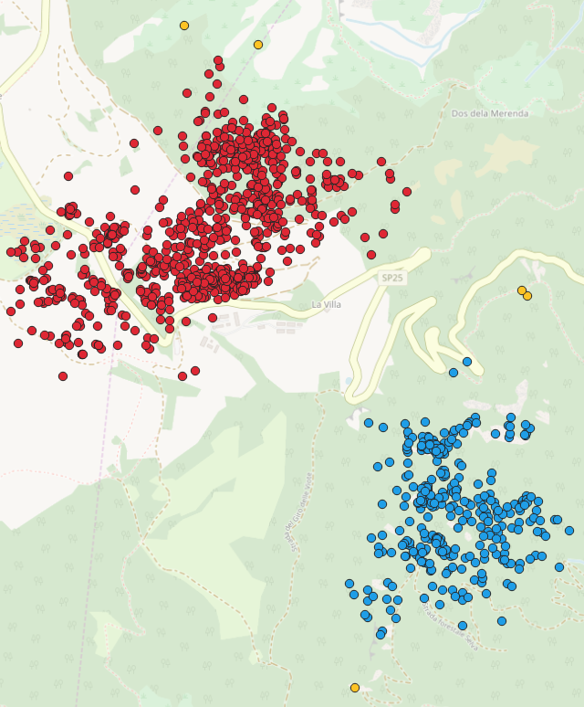
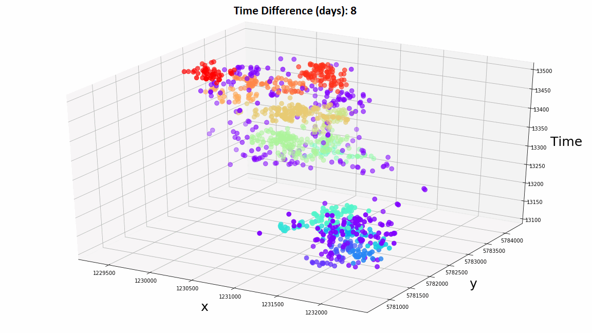

# DBSCAN implementation and PostGIS integration in Python

Project developed for the "Geospatial Information Management" master course.

This repository shows how to implement from scratch the DBSCAN algorithm in Python, taking into account both
spatial and temporal dimensions.

DBSCAN is applied on the dataset "animale" which contains a trajectory 
of 1189 points taken from a roe deer. The positions are expressed in projected 
coordinates (EPSG 3857). DBSCAN allows finding the most densely populated areas by the roe deer.

Finally, the repository also shows how to integrate PostGIS in Python for Geospatial data analysis.

Repository files:

- DBSCAN.ipynb: notebook divided into three sections:
  - integration of PostGIS in Python through the psycopg2 library
  - implementation of DBSCAN by taking into account only the spatial dimension of the data
  - implementation of DBSCAN by taking into account both the spatial and the temporal dimension of the data

- DBSCAN_no_time.csv: csv file containing the data labeled based on the application of DBSCAN without 
considering the temporal dimension of data.  
Each original data point is associated with a label encoding the cluster found through DBSCAN.

- DBCSCAN_with_time.csv: csv file in which the original data point are labeled based on the cluster
founds through DBSCAN by considering both their spatial and temporal dimensions. 

Screenshot from QGIS about the original data points clustered through DBSCAN, only considering
their spatial dimension.

Original data points clustered based on both their spatial and temporal dimensions. 
The gif shows how changing the time difference considered by DBSCAN affects the clusters found.

